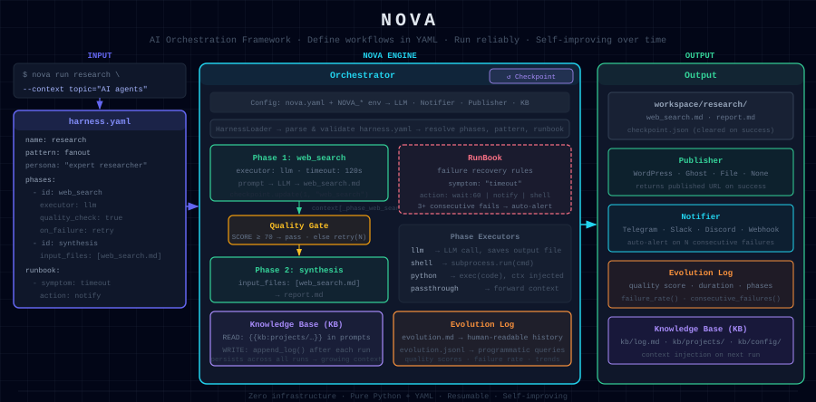
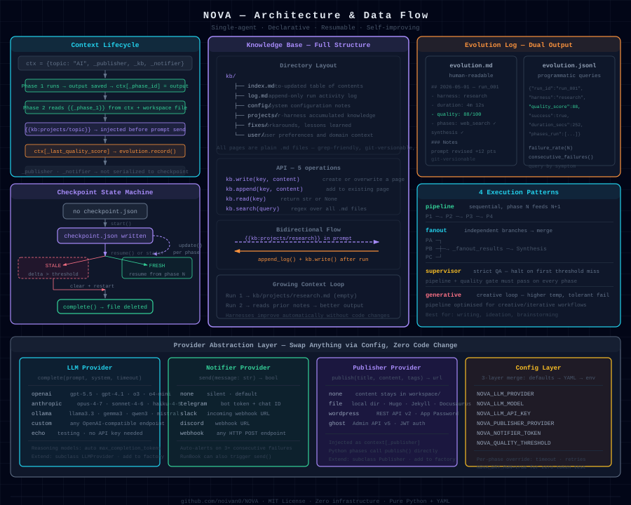

# NOVA — AI Orchestration Framework

<p align="center">
  <b>Define complex AI workflows in YAML. Run them end-to-end with one command.</b><br/>
  Checkpointing · Quality Gates · Self-improving logs · Pluggable LLM / Publisher / Notifier
</p>

<p align="center">
  
  
  
  
  
</p>

<p align="center">
  
</p>

---

## What is NOVA?

NOVA is a **single-agent AI orchestration framework** that lets you define multi-step AI workflows
in a simple YAML file — called a **harness** — and execute them reliably, end-to-end, with a single command.

Think of it as a CI/CD pipeline for AI tasks: each phase is a step (LLM call, shell command, or Python code),
phases flow into each other, quality is automatically checked, failures trigger recovery rules,
and every run is logged so your workflow gets better over time.

```
nova run research --context topic="the future of AI agents"
```

That one command: searches from multiple angles → synthesises findings → runs a quality check
→ writes a final report — and sends you a Telegram notification when done.

---

## Why NOVA?

| Problem | How NOVA solves it |
|---|---|
| LLM calls fail or time out mid-workflow | **Checkpointing** — resume from the exact phase that failed |
| LLM output quality is inconsistent | **Quality Gates** — auto-score output, retry if below threshold |
| Hard to know if a workflow is improving | **Evolution Log** — every run is recorded; spot patterns across hundreds of runs |
| Switching LLM providers requires code changes | **Provider abstraction** — swap OpenAI ↔ Anthropic ↔ Ollama via one config line |
| Complex pipelines need complex code | **Harness YAML** — the entire workflow is a readable, version-controllable YAML file |
| Output needs to go somewhere | **Publisher backends** — WordPress, Ghost, or local file, configured not coded |
| No visibility when long jobs run unattended | **Notifier** — Telegram, Slack, or Discord alert on completion or failure |

---

## Key Features

- **Declarative workflows** — entire pipeline logic lives in `harness.yaml`, not buried in code
- **4 execution patterns** — `pipeline` (sequential), `fanout` (parallel branches), `supervisor` (strict QA), `generative` (creative)
- **4 phase executors** — `llm` (LLM call), `shell` (subprocess), `python` (inline code), `passthrough` (forward context)
- **Resumable by default** — checkpoint saved after every phase; `--resume` picks up exactly where it stopped
- **Quality Gate** — LLM outputs a score; NOVA retries automatically if below your threshold
- **RunBook** — declarative failure recovery: `rate limit → wait 60s → retry`, `timeout → notify`
- **Evolution Log** — per-harness run history in Markdown + JSONL; track quality score trends
- **Knowledge Base (KB)** — persistent markdown store across runs; inject prior context into prompts. Full Agent KB Pattern module (`nova/kb/`) with hybrid BM25 + vector search, pluggable embedding backends, and incremental SQLite sync
- **Autonomous Event Loop** — inotify-based watcher replaces cron jobs; reacts to DB/KB changes instantly. 14 cron jobs eliminated, zero polling loops. See [Autonomous Event Loop guide](docs/guides/autonomous-event-loop.md)
- **Native architecture intelligence** — build a local structural graph, inspect hotspots, bridges, and execution paths without external graph tooling
- **Zero infrastructure** — no databases, no message queues, no Docker required; pure Python + YAML
- **Minimal dependencies** — core requires only `pyyaml`; LLM SDKs are optional extras

---

## Architecture

```
┌─────────────────────────────────────────────────────────────────────┐
│  CLI  nova run <harness> [--resume] [--dry-run] --context k=v       │
└────────────────────────┬────────────────────────────────────────────┘
                         │
            ┌────────────▼────────────┐
            │      Config Layer        │
            │  nova.yaml + NOVA_* env  │
            │  LLM · Notifier · Pub    │
            └────────────┬────────────┘
                         │
            ┌────────────▼────────────┐
            │    Harness Loader        │
            │  Parses harness.yaml     │
            │  Validates phases/rules  │
            └────────────┬────────────┘
                         │
            ┌────────────▼────────────┐
            │  Checkpoint · Resume     │
            │  Restores from last      │
            │  completed phase         │
            └────────────┬────────────┘
                         │
      ┌──────────────────▼──────────────────────┐
      │               Orchestrator               │
      │                                          │
      │   pattern=pipeline      pattern=fanout   │
      │   ┌──────────────┐     ┌─────────────┐  │
      │   │ Phase 1      │     │ Phase A     │  │
      │   │ Phase 2      │     │ Phase B     │  │ (parallel)
      │   │ Phase 3      │     │ Phase C     │  │
      │   └──────┬───────┘     └──────┬──────┘  │
      │          │                    │          │
      │   ┌──────▼───────┐    ┌──────▼──────┐   │
      │   │ Quality Gate │    │   Merge     │   │
      │   │ score < 70?  │    │  Results    │   │
      │   │ → retry      │    └─────────────┘   │
      │   └──────────────┘                      │
      └──────────────────────┬──────────────────┘
                             │
           ┌─────────────────┴──────────────────┐
           │                                    │
┌──────────▼───────┐              ┌─────────────▼──────┐
│  Evolution Log   │              │  KB · Notifier     │
│  run_YYYYMMDD    │              │  Markdown store     │
│  quality trend   │              │  Telegram/Slack     │
└──────────────────┘              └────────────────────┘
```

**Phase executors** at each step:

| Executor | What it does |
|---|---|
| `llm` | Sends a prompt (from file or inline) to your LLM provider, saves output |
| `shell` | Runs a shell command via `subprocess.run` |
| `python` | Executes inline Python code; `context` dict and `workspace` Path are injected |
| `passthrough` | Forwards context unchanged — useful for branching harness logic |

---

## Quick Start (5 minutes)

### 1. Clone and install

```bash
git clone https://github.com/noivan0/NOVA.git
cd NOVA

# Preferred release-safe installs:
pip install ".[openai]"      # OpenAI (GPT-4o, GPT-4.1, o3, o4-mini …)
pip install ".[anthropic]"   # Anthropic Claude
pip install ".[ollama]"      # Local Ollama — no API key needed
pip install ".[all]"         # All providers at once

# Editable install is intended for development only:
# pip install -e ".[openai]"
```

### 2. Set your API key

```bash
cp .env.example .env
```

Open `.env` and set at minimum:

```bash
NOVA_LLM_PROVIDER=openai          # or anthropic / ollama / custom
NOVA_LLM_MODEL=gpt-4o             # or claude-sonnet-4-6 / llama3.3 …
NOVA_LLM_API_KEY=***              # not needed for ollama
```

### 3. Run your first harness

```bash
# Research harness — gathers info from multiple angles, synthesises a report
nova run research --context topic="the future of AI agents"

# Resume if interrupted
nova run research --resume

# Dry run — validate structure, preview prompts, no LLM calls
nova run research --context topic="test" --dry-run
```

### 4. Inspect results

```bash
nova list                          # List all harnesses in harnesses/
nova status research               # Current checkpoint state
nova evolution research            # Run history: quality scores, durations, failures
nova kb search "AI agents"         # Full-text search your persistent KB
nova kb list                       # All KB pages
```

### 5. Inspect architecture

```bash
nova inspect build .
nova inspect hotspots .
nova inspect bridges .
nova inspect path . --from main --to Orchestrator
nova inspect report .
```

Artifacts are written to `.nova-arch/` (`graph.json`, `summary.json`, `report.md`).

### 6. Scaffold a new harness

```bash
nova new my-workflow --pattern pipeline
# Creates harnesses/my-workflow/harness.yaml + prompts/ skeleton
# Edit the YAML and prompts, then:
nova run my-workflow --context key=value
```

---

## Detailed Usage

### Running a harness

```bash
nova run <harness-name> [options]

Options:
  --resume          Resume from last checkpoint (skip already-completed phases)
  --dry-run         Print prompts and phase plan without making any LLM calls
  --config FILE     Config file path (default: nova.yaml)
  --context k=v     Pass one or more context variables; repeat for multiple
```

**Multiple context variables:**

```bash
nova run research \
  --context topic="AI coding assistants" \
           depth="comprehensive" \
           audience="developers"
```

**Override the LLM model for a single run:**

```bash
NOVA_LLM_MODEL=gpt-4o-mini nova run research --context topic="quick test"
```

### Checking run history (Evolution)

```bash
nova evolution research
```

Output example:
```
Run History — research
============================================================
run_20260430_103000_abc1  SUCCESS  quality=88  duration=4m12s
run_20260429_091500_def2  FAILED   phase=synthesis  error=timeout
run_20260428_150200_ghi3  SUCCESS  quality=76  duration=5m01s

Average quality score: 82
Success rate: 67% (2/3)
Consecutive failures: 0
```

### Searching the Knowledge Base

```bash
nova kb search "prior research notes"      # Full-text search
nova kb list                               # List all KB pages
nova kb write tips docs/notes.md           # Import a file into the KB
```

---

## Writing a Harness

### Minimal harness

```yaml
# harnesses/my-summary/harness.yaml
name: my-summary
description: "Summarise a topic in 3 bullet points"
version: "1.0.0"
pattern: pipeline

phases:
  - id: summarise
    name: "Summarise"
    executor: llm
    prompt: |
      Summarise "{{topic}}" in exactly 3 bullet points.
      Be concise and practical.
    output_file: summary.md
    on_failure: retry
```

Run it:
```bash
nova run my-summary --context topic="machine learning basics"
cat workspace/my-summary/summary.md
```

### Full harness reference

```yaml
name: my-harness
description: "What this workflow does"
version: "1.0.0"

# Execution pattern (see Patterns section below)
pattern: pipeline          # pipeline | fanout | supervisor | generative

# Optional: system prompt injected into every LLM call in this harness
persona: |
  A senior technical writer producing clear, actionable documentation
  for developers. Use concrete examples. Avoid jargon.

phases:
  - id: research
    name: "Research Phase"
    description: "Gather background information"
    executor: llm                  # llm | shell | python | passthrough

    # LLM executor: use prompt_file OR inline prompt
    prompt_file: prompts/research.txt     # file in harness directory
    # prompt: "Inline prompt text with {{topic}} template variables"

    # Files from workspace/ to inject into prompt context
    input_files:
      - prior_notes.md             # injected as [prior_notes.md]\n<content>\n

    output_file: research.md       # saved to workspace/

    timeout: 180                   # seconds (overrides global phase_timeout)
    retries: 3                     # overrides global max_retries
    quality_check: true            # parse SCORE from output; retry if below threshold
    on_failure: retry              # retry | skip | abort | runbook

  - id: shell_step
    name: "Run a script"
    executor: shell
    command: "python scripts/process.py --input workspace/research.md"
    output_file: processed.txt
    on_failure: skip

  - id: python_step
    name: "Custom Python"
    executor: python
    command: |
      # Variables injected: context (dict), workspace (Path), _publisher, _notifier
      data = (workspace / "research.md").read_text()
      summary = data[:500]           # first 500 chars
      output = f"Summary:\n{summary}"
    output_file: summary.txt
    on_failure: abort

  - id: publish
    name: "Publish"
    executor: python
    command: |
      publisher = context["_publisher"]
      content = (workspace / "final.md").read_text()
      url = publisher.publish(
          title=context["title"],
          content=content,
          tags=["ai", "automation"],
      )
      output = url or "saved locally"
    output_file: result.txt
    on_failure: skip

# Automatic failure recovery rules
runbook:
  - symptom: "rate limit"          # matched against error message (case-insensitive)
    action: "wait:60"              # built-in: wait N seconds then retry
  - symptom: "timeout"
    action: "notify"               # built-in: send notifier alert
  - symptom: "connection error"
    action: "wait:30"

# Run history logging (recommended: always enable)
evolution:
  enabled: true
  file: evolution.md               # written to harness directory
```

### Prompt files

Prompt files live in `harnesses/<name>/prompts/`. Use `{{variable}}` for template substitution:

```
# harnesses/research/prompts/synthesis.txt

You are an expert researcher. Synthesise the findings below into a comprehensive report.

Topic: {{topic}}

--- RESEARCH DATA ---
{{web_search.md}}

--- INSTRUCTIONS ---
- Length: 800-1200 words
- Be objective and cite sources when possible
- Highlight key findings and open questions

Write the complete report now:
```

Variables available in every prompt:
- `{{key}}` — any `--context key=value` passed at the CLI
- `{{filename.md}}` — content of an `input_files` entry
- `{{_phase_<id>}}` — output of a previously completed phase

---

## Execution Patterns

### `pipeline` — Sequential

Each phase runs in order. The output of phase N is available to phase N+1 via `input_files` or `{{_phase_N}}`.

```
Phase 1 → Phase 2 → Phase 3 → Phase 4
```

Best for: research reports, document processing, code generation pipelines.

### `fanout` — Parallel branches

All phases run independently (sequentially in current implementation, merged at the end).
Results are collected into `_fanout_results` for a synthesis phase.

```
Phase A ─┐
Phase B ─┼─→ (merge) → Synthesis
Phase C ─┘
```

Best for: multi-angle research, A/B content generation, parallel data gathering.

### `supervisor` — Quality-enforced pipeline

Like `pipeline`, but with stricter quality enforcement: the workflow halts on the first phase
that cannot reach the quality threshold after all retries.

Best for: high-stakes content, automated publishing where quality must be guaranteed.

### `generative` — Creative pipeline

Like `pipeline`, optimised for creative and generative workflows with higher temperature defaults
and more tolerant failure handling.

Best for: creative writing, ideation, brainstorming workflows.

---

## Quality Gate

Add `quality_check: true` to any phase to activate automatic quality scoring.

The LLM response is scanned for a numeric score in any of these formats:

```
SCORE: 85
Quality: 72/100
quality_score: 90
[SCORE=88]
85 out of 100
Score — 78
```

**What happens:**
- Score ≥ `quality_threshold` (default: 70) → phase passes, execution continues
- Score < threshold → phase retries (up to `max_retries` times)
- No score found → gate is skipped (not failed) — the phase passes
- All retries exhausted → `on_failure` rule applies

**Example quality check prompt** (`prompts/quality_check.txt`):

```
Review the following research report and score it.

--- REPORT ---
{{draft.md}}

Evaluate on:
- Accuracy and depth (0-40)
- Clarity and structure (0-30)
- Coverage and completeness (0-30)

Provide specific improvement notes, then on the final line write:
SCORE: <total>/100
```

---

## Knowledge Base (KB)

NOVA includes a lightweight, file-based knowledge base that persists across runs.

```
kb/
├── index.md          ← auto-updated table of contents
├── log.md            ← append-only activity log
├── config/           ← system configuration notes
├── fixes/            ← workarounds and lessons learned
├── projects/         ← per-harness notes
└── user/             ← user preferences and context
```

**CLI:**
```bash
nova kb write config/notes notes.md           # import file into KB
nova kb search "rate limit workaround"        # full-text search
nova kb list                                  # list all pages
```

**In a Python phase:**
```python
# context["_kb"] is injected automatically
kb = context["_kb"]
notes = kb.read("config/notes")
kb.write("projects/my-harness", "# Run notes\n\nSomething useful.")
kb.append_log("my-harness | phase 3 complete — quality 88")
```

**In a prompt:**
```
Use the following prior research when writing this report:
{{kb:projects/my-topic-research}}
```

---

## Agent KB Pattern (`nova/kb/`) — v1.2.0

For agents that run continuously across many sessions, NOVA includes a full implementation of the
[Agent KB Pattern](https://gist.github.com/noivan0/2c1129a2b8d829be70cab1439d4c6e18) —
a persistent, compounding knowledge base inspired by Karpathy's LLM Wiki, extended for autonomous agents.

The pattern solves the core problem of LLM agents: they forget everything when a session ends.
The KB acts as long-term memory — written by the agent, read by the agent, queryable in < 200ms without a vector DB.

```python
from nova.kb import KBManager, KBSync, KBSearch
from nova.kb.sync import local_embed   # no API key needed

# Write operational knowledge
kb = KBManager("~/.agent/kb")
kb.write(
    name="ssl-cert-error",
    subdir="fixes",
    page_type="fix",
    tags=["ssl", "docker"],
    status="resolved",
    body="## Root Cause\nMissing REQUESTS_CA_BUNDLE...\n\n## Fix\nSet in .env: REQUESTS_CA_BUNDLE=...",
)

# Incremental embedding sync — only re-embeds changed pages
sync = KBSync("~/.agent/kb", "~/.agent/embeddings.db", embed_fn=local_embed)
sync.run()  # {"indexed": 3, "skipped": 12, "errors": 0}

# Hybrid search: BM25 keyword + cosine similarity, no external vector DB
search = KBSearch("~/.agent/kb", "~/.agent/embeddings.db")
results = search.query("ssl certificate error", mode="hybrid", top_k=5)
# → [{"path": "fixes/ssl-cert-error.md", "score": 0.87, "snippet": "..."}]
```

**Run the quickstart example (no API key needed):**
```bash
python examples/kb_quickstart.py
```

**CLI sync:**
```bash
# Keyword-only (instant, no API)
python -m nova.kb.sync --kb ~/.agent/kb --db ~/.agent/embeddings.db

# With local embeddings (sentence-transformers, no API cost)
pip install sentence-transformers
python -m nova.kb.sync --kb ~/.agent/kb --db ~/.agent/embeddings.db --backend local

# With OpenAI embeddings
python -m nova.kb.sync --kb ~/.agent/kb --db ~/.agent/embeddings.db \
  --backend openai --api-key $OPENAI_API_KEY

# Search
python -m nova.kb.search "ssl certificate error" --kb ~/.agent/kb --db ~/.agent/embeddings.db
```

**Key design decisions:**
- **SQLite only** — no Pinecone, Chroma, or Weaviate. Float32 blobs stored directly in `embeddings.db`.
- **Hash-based dedup** — pages only re-embedded when content actually changes (sha256 check).
- **H2-section chunking** — finds the *specific section* of a page, not just the page.
- **Pluggable backends** — OpenAI, sentence-transformers, Ollama, or keyword-only fallback.
- **Multi-namespace** — search across KB + project KB + past sessions in one query.

See the [canonical pattern doc](https://gist.github.com/noivan0/2c1129a2b8d829be70cab1439d4c6e18) for
the full two-layer memory model, `[ACTIVE]` tag system, session continuity protocol, and more.

---

## Evolution Log

Every harness run is automatically appended to `harnesses/<name>/evolution.md` (Markdown)
and `harnesses/<name>/evolution.jsonl` (JSON Lines for programmatic analysis).

Example `evolution.md` entry:
```markdown
## run_20260430_103000_abc12345

- **Status:** SUCCESS
- **Pattern:** fanout
- **Duration:** 4m 12s
- **Quality score:** 88/100
- **Phases:** web_search ✓ · synthesis ✓

### Notes
Quality improved from 76 → 88 after refining the synthesis prompt.
```

Use `nova evolution <harness>` to view aggregated statistics across all runs.

---

## Supported Providers

### LLM Providers

| Provider | `llm.provider` | Recommended models | Install |
|---|---|---|---|
| **OpenAI** | `openai` | `gpt-5.5`, `gpt-5`, `gpt-4.1`, `gpt-4.1-mini`, `gpt-4.1-nano`, `o3`, `o4-mini` | `pip install "nova-orchestrator[openai]"` |
| **Anthropic** | `anthropic` | `claude-opus-4-7`, `claude-sonnet-4-6`, `claude-haiku-4-5` | `pip install "nova-orchestrator[anthropic]"` |
| **Ollama** (local) | `ollama` | `llama3.3`, `gemma3`, `qwen3`, `mistral`, `deepseek-r1` | `pip install "nova-orchestrator[ollama]"` |
| **Custom endpoint** | `custom` | Any OpenAI-compatible API (LM Studio, vLLM, LocalAI, Azure OpenAI …) | — |
| **Echo** (testing) | `echo` | — Returns prompt back; no API key needed | — |

> **Reasoning models (o1, o3, o4-mini):** NOVA automatically switches to `max_completion_tokens`
> and omits `temperature` — fully compliant with the OpenAI reasoning model API spec.

> **Local inference with Ollama:** Install [Ollama](https://ollama.com), pull a model
> (`ollama pull llama3.3`), then set `NOVA_LLM_PROVIDER=ollama` — no API key, no cost.

### Notifier Providers

| Provider | `notifier.provider` | What you need |
|---|---|---|
| **None** | `none` | Default — silent operation |
| **Telegram** | `telegram` | Bot token + chat ID |
| **Slack** | `slack` | Incoming Webhook URL |
| **Discord** | `discord` | Webhook URL |
| **Generic Webhook** | `webhook` | Any HTTP POST endpoint |

### Publisher Providers

| Provider | `publisher.provider` | What you need |
|---|---|---|
| **None** | `none` | Content stays in `workspace/` |
| **File** | `file` | Local output directory (great for Hugo, Jekyll, Docusaurus) |
| **WordPress** | `wordpress` | Site URL + Application Password (`user:app_password`) |
| **Ghost** | `ghost` | Site URL + Admin API key (`id:hex_secret`) |

---

## Configuration

NOVA merges configuration from three layers (later layers override earlier):

1. **Built-in defaults** (see `nova/core/config.py`)
2. **`nova.yaml`** in the working directory
3. **Environment variables** (`NOVA_*`)

### `nova.yaml` — full reference

```yaml
# Paths
workspace: ./workspace          # Where harness run artifacts are stored
harnesses_dir: ./harnesses      # Where harness directories live

# LLM
llm:
  provider: openai              # openai | anthropic | ollama | custom | echo
  model: gpt-4o
  api_key: ""                   # Or NOVA_LLM_API_KEY env var
  base_url: ""                  # For custom/enterprise endpoints
  max_tokens: 4096
  temperature: 0.7
  timeout: 120                  # Seconds per LLM call

# Notifier (optional)
notifier:
  provider: none                # none | telegram | slack | discord | webhook
  token: ""                     # Telegram bot token
  chat_id: ""                   # Telegram chat ID
  webhook_url: ""               # Slack / Discord / generic webhook

# Publisher (optional)
publisher:
  provider: file                # none | file | wordpress | ghost
  output_dir: ./output          # For file publisher
  api_key: ""                   # WordPress: "user:app_password", Ghost: "id:secret"
  base_url: ""                  # WordPress / Ghost site URL

# KB
kb:
  path: ./kb

# Execution defaults (can be overridden per phase)
phase_timeout: 300              # Seconds per phase
max_retries: 2                  # Phase retry attempts
quality_threshold: 70           # Minimum score (0-100) to pass quality gate
```

### Environment variables

| Variable | Description | Default |
|---|---|---|
| `NOVA_LLM_PROVIDER` | LLM provider | `openai` |
| `NOVA_LLM_MODEL` | Model name | `gpt-4o` |
| `NOVA_LLM_API_KEY` | API key | — |
| `NOVA_LLM_BASE_URL` | Custom base URL | — |
| `NOVA_LLM_MAX_TOKENS` | Max tokens per call | `4096` |
| `NOVA_LLM_TEMPERATURE` | Temperature | `0.7` |
| `NOVA_LLM_TIMEOUT` | Timeout seconds | `120` |
| `NOVA_NOTIFIER_PROVIDER` | Notifier type | `none` |
| `NOVA_NOTIFIER_TOKEN` | Telegram bot token | — |
| `NOVA_NOTIFIER_CHAT_ID` | Telegram chat ID | — |
| `NOVA_NOTIFIER_WEBHOOK_URL` | Slack/Discord webhook | — |
| `NOVA_PUBLISHER_PROVIDER` | Publisher type | `file` |
| `NOVA_PUBLISHER_API_KEY` | Publisher credentials | — |
| `NOVA_PUBLISHER_BASE_URL` | Publisher site URL | — |
| `NOVA_WORKSPACE` | Workspace directory | `./workspace` |
| `NOVA_KB_PATH` | KB directory | `./kb` |
| `NOVA_HARNESSES_DIR` | Harnesses directory | `./harnesses` |
| `NOVA_QUALITY_THRESHOLD` | Default quality threshold | `70` |
| `NOVA_MAX_RETRIES` | Default retry count | `2` |
| `NOVA_PHASE_TIMEOUT` | Default phase timeout | `300` |
| `NOVA_DRY_RUN` | `true` to skip LLM calls | `false` |

---

## Use Cases

### 1. Research reports

Synthesise a comprehensive report from multiple angles:

```bash
nova run research --context topic="competitive analysis of AI coding assistants"
cat workspace/research/report.md
```

### 2. Local inference (no API cost)

Run entirely locally with Ollama — no API key, no cost:

```bash
ollama pull llama3.3
NOVA_LLM_PROVIDER=ollama \
NOVA_LLM_MODEL=llama3.3 \
nova run research --context topic="Python best practices"
```

### 3. Scheduled workflows (cron)

```bash
# In crontab — run every Monday at 09:00
0 9 * * 1 cd /path/to/NOVA && nova run research \
  --context topic="Weekly AI digest"
```

### 4. Publish to WordPress or Ghost

```bash
NOVA_PUBLISHER_PROVIDER=wordpress \
NOVA_PUBLISHER_BASE_URL=https://myblog.com \
NOVA_PUBLISHER_API_KEY="admin:app_password" \
nova run my-harness --context title="My Post"
```

### 5. Custom workflow

Create a harness for any multi-step AI task:

```bash
nova new code-review --pattern pipeline
# Edit harnesses/code-review/harness.yaml
nova run code-review --context pr_diff="$(git diff main)"
```

---

## Architecture

<p align="center">
  
</p>

The diagram above shows:
- **Context lifecycle** — how data flows from your `--context` flag through every phase
- **Checkpoint state machine** — start → update per phase → stale check → complete
- **KB bidirectional flow** — `{{kb:…}}` injected into prompts; results written back after each run
- **Evolution dual output** — human-readable Markdown + machine-queryable JSONL side by side
- **4 execution patterns** — pipeline, fanout, supervisor, generative
- **Provider abstraction** — swap LLM / Notifier / Publisher with one config line

For a full architecture walkthrough see [docs/architecture.md](docs/architecture.md).

---

## Project Structure

```
NOVA/
├── nova/
│   ├── core/
│   │   ├── config.py        # Configuration loading — YAML + env vars, 3-layer merge
│   │   ├── harness.py       # Harness YAML parser and dataclass definitions
│   │   ├── orchestrator.py  # Execution engine — pipeline / fanout patterns
│   │   ├── checkpoint.py    # Resumable state — JSON file per harness
│   │   ├── evolution.py     # Run history — Markdown + JSONL logging
│   │   └── kb.py            # Markdown knowledge base — read/write/search
│   ├── kb/                  # Agent KB Pattern module (v1.2.0)
│   │   ├── __init__.py      # KBManager · KBSync · KBSearch
│   │   ├── manager.py       # Read/write KB pages with YAML frontmatter validation
│   │   ├── sync.py          # Incremental embedding sync into SQLite (hash-based dedup)
│   │   └── search.py        # Hybrid BM25 + cosine search, no external vector DB
│   ├── providers/
│   │   ├── llm.py           # OpenAI · Anthropic · Ollama · Custom · Echo
│   │   ├── notifier.py      # Telegram · Slack · Discord · Webhook · None
│   │   └── publisher.py     # WordPress · Ghost · File · None
│   └── cli/
│       └── main.py          # `nova` CLI — run / list / status / evolution / kb / new
├── harnesses/
│   ├── research/            # Multi-angle research synthesis (fanout pattern)
│   │   ├── harness.yaml
│   │   └── prompts/         # web_search.txt · synthesis.txt
│   ├── summarizer/          # Multi-level content summarizer (TL;DR → deep analysis)
│   │   └── harness.yaml
│   └── data-pipeline/       # CSV profiling + LLM insight extraction + report
│       └── harness.yaml
├── examples/
│   ├── quickstart.py        # Minimal programmatic usage example
│   ├── custom_provider.py   # How to implement a custom LLM provider
│   ├── custom_publisher.py  # How to implement a custom publisher
│   └── kb_quickstart.py     # Agent KB Pattern — self-contained demo (no API key needed)
├── tests/
│   ├── unit/                # Checkpoint · Evolution · Harness loader · KB (no API key)
│   └── integration/         # Orchestrator with echo provider (no API key needed)
├── docs/
│   ├── architecture.md      # Deep-dive architecture documentation
│   └── guides/
│       ├── quickstart.md              # Step-by-step first run guide
│       ├── writing-harnesses.md       # Complete harness authoring guide
│       ├── providers.md               # Provider setup (OpenAI, Anthropic, Ollama, …)
│       ├── quality-gates.md           # How quality scoring works
│       ├── custom-provider.md         # How to add a custom LLM / publisher / notifier
│       └── autonomous-event-loop.md   # Event-driven autonomy — replace cron with inotify
├── CONTRIBUTING.md          # Contributor guide (setup, style, PR process)
├── CHANGELOG.md             # Version history
├── docker-compose.yml       # Docker Compose for containerised runs
├── nova.yaml                # Default configuration (edit this)
├── .env.example             # Environment variable template
└── pyproject.toml           # Package metadata + optional dependencies
```

---

## Running Tests

All 14 tests pass with no API key required (uses the built-in `echo` provider):

```bash
pip install -e ".[dev]"
pytest tests/ -v
```

```
tests/unit/test_checkpoint.py        PASSED  (4 tests)
tests/unit/test_evolution.py         PASSED  (3 tests)
tests/unit/test_harness_loader.py    PASSED  (4 tests)
tests/unit/test_kb.py                PASSED  (2 tests)
tests/integration/test_orchestrator_echo.py  PASSED  (1 test)
```

---

## Docker

Run NOVA in a container without installing Python dependencies locally:

```bash
# Research harness
docker compose run nova nova run research --context topic="AI agents 2026"

# Custom harness
docker compose run nova nova run my-workflow --context key=value
```

The `docker-compose.yml` mounts the current directory and passes through `NOVA_*` environment variables.

---

## Adding a Custom Provider

### Custom LLM provider

```python
# examples/custom_provider.py
from nova.providers.llm import LLMProvider
from nova.core.config import LLMConfig

class MyCustomLLM(LLMProvider):
    def __init__(self, cfg: LLMConfig):
        self.endpoint = cfg.base_url
        self.api_key = cfg.api_key

    def complete(self, prompt: str, system: str = "", timeout: int = 120) -> str:
        # Call your LLM API here
        import urllib.request, json
        payload = json.dumps({"prompt": prompt, "system": system}).encode()
        req = urllib.request.Request(
            self.endpoint,
            data=payload,
            headers={"Authorization": f"Bearer {self.api_key}"},
        )
        with urllib.request.urlopen(req, timeout=timeout) as resp:
            return json.loads(resp.read())["text"]
```

### Custom publisher

```python
# examples/custom_publisher.py
from nova.providers.publisher import Publisher
from nova.core.config import PublisherConfig
from typing import List, Optional

class MyPublisher(Publisher):
    def __init__(self, cfg: PublisherConfig):
        self.api_key = cfg.api_key

    def publish(
        self,
        title: str,
        content: str,
        tags: Optional[List[str]] = None,
        metadata: Optional[dict] = None,
    ) -> Optional[str]:
        # Publish to your platform and return the URL
        print(f"Publishing: {title}")
        return "https://example.com/my-post"
```

Register your provider in `nova/providers/llm.py` or `nova/providers/publisher.py`
by adding it to the `get_llm_provider()` / `get_publisher()` factory functions.

---

## Roadmap

- [ ] Parallel phase execution (true async fanout)
- [ ] Web UI — harness status dashboard
- [ ] PyPI package (`pip install nova-orchestrator`)
- [ ] HuggingFace Inference API provider
- [ ] Medium / Substack publisher
- [ ] Harness marketplace (share and import community harnesses)
- [ ] Streaming LLM output support
- [ ] NOVA MCP server (use as a Model Context Protocol tool)
- [ ] `nova/kb/` — Obsidian headless sync for remote KB browsing

---

## Contributing

Contributions are welcome — bug fixes, new providers, new harness examples, documentation.

See **[CONTRIBUTING.md](CONTRIBUTING.md)** for the full guide: development setup, code style, test requirements, and PR process.

Quick start for contributors:

```bash
git clone https://github.com/noivan0/NOVA.git
cd NOVA
pip install -e ".[dev]"
python -m pytest tests/ -v   # all tests pass with no API key
```

---

## Changelog

See **[CHANGELOG.md](CHANGELOG.md)** for a full version history.

---

## License

MIT — see [LICENSE](LICENSE)

---

<p align="center">
  Built with ❤️ — <a href="https://github.com/noivan0/NOVA">github.com/noivan0/NOVA</a>
</p>
